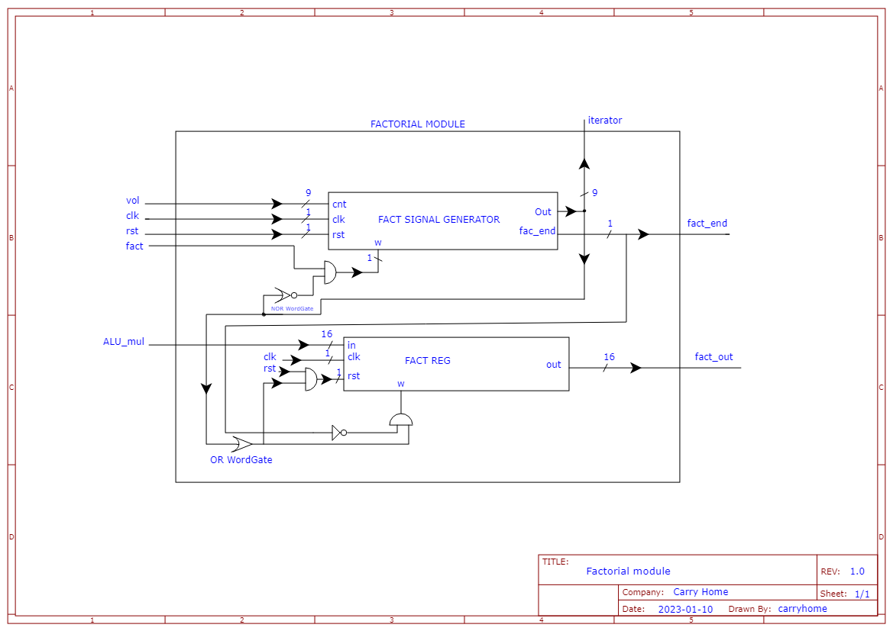

# gpp_calc

<p align="center">
  
</p>

Design and implementation of a 16 bit GPP along with ASIP for a pocket calculator

## How to run

- The files from the rtl folder and the gpp_calc_core_tb.v file from the tb folder are loaded into Modelsim
- Copy the assembler from the folder sw/dist/Sebi's Assembler.exe to the win32aloem folder of Modelsim (recommended step)
- Open the assembler, write code using the valid Instruction Set in the documentation in the doc/Documentatie_GPP folder or the one in doc/gpp_calc - Instruction Set.docx and compile (assemble)

**Careful! It is recommended to end the code with an unconditional jump instruction through which the processor will remain in an infinite loop.** Example:

END: BRA END

- If the assembler was copied into the win32aloem folder, then a "test.fic" file will appear in the same folder representing the assembly result. If not, that file must be copied from where it was generated (from the folder where the assembler's .exe file was placed) to the Win32aloem folder of Modelsim

**Careful! The file test.fic must keep its name. If the name of this file is changed, the Verilog code in gpp_calc_core_tb.v must also be changed to reflect this change.**

- The gpp_calc_core_tb.v test bench is run and the results of the simulation will be displayed on the screen.

### Code example
```
FCT X 4
FCT Y 5
ADD Y
SUB X
END: BRA END
```
This code calculates 5! - 4! and the result is stored in the acumulator.

## Hardware design

### Main scheme

<p align="center">
  
</p>

### ALU

<p align="center">
  
</p>

### Control Unit

<p align="center">
  
</p>

### Factorial Module

<p align="center">
  
</p>
